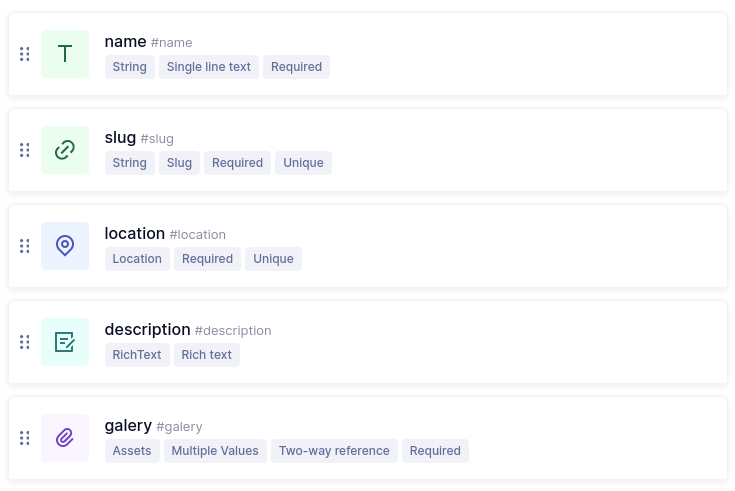
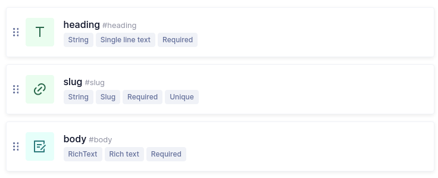

# My Trip

🌐 _Para a versão em português deste README, [clique aqui](./docs/locales/pt-br/README.md)._

## Main goal:
Create an application to show the pinned places you've visited or want to go on a map.
## How to run the project?
### 1. Installation:

Clone the repo:
```bash
git clone https://github.com/EuCarlos/my-trip-nextjs-graphql-leaflet.git && cd my-trip-nextjs-graphql-leaflet
```

Install dependencies using Yarn or NPM:

```diff
yarn install

! Or using NPM if you don't have Yarn installed.
npm install
```

### 2. GraphCMS:

This project uses [GraphCMS](https://graphcms.com/), so you need to create an account there first.

After you need to create the Schema, just follow the steps:

- Schema > Add New Model with `Place` name
- And add the following fields:
  - `Single Line Text` as `name`
  - `Slug` as `slug`
  - `Map` as `location`
  - `Rich Text` as `description`
  - `Asset Picker` as `gallery`

<p align="center">
  <br>

  <h5 align="center"><strong>place</strong> - Schema - GraphCMS</h5>
</p>

- Schema > Add New Model with `Page` name
- And add the following fields:
  - `Single Line Text` as `heading`
  - `Slug` as `slug`
  - `Rich Text` as `body`

<p align="center">
  <br>

  <h5 align="center"><strong>page</strong> - Schema - GraphCMS</h5>
</p>

❗ After that, fill some values and don't forget to `publish

### 2.1 Authentication

In order to create a token access, go to `Settings > API Access`, inside this page, find `Permanent Auth Tokens`,
create a Token Name and mark all queries possible. Save and get the token.tas possíveis. Salve e obtenha o token.

### 3. Run the project

After creating your account on [GraphCMS](https://graphcms.com/) and following the steps above, you just need to rename
the `.env.development` to `.env.local` (if you plan to run locally) and edit the keys there.

With all set, you can start the application

```diff
yarn dev

! Or using NPM if you don't have Yarn installed.
npm run dev
```

Open [http://localhost:3000](http://localhost:3000) with your browser to see the result.

### Other commands

- `dev`: runs your application on `localhost:3000`
- `build`: creates the production build version
- `start`: starts a simple server with the build production code
- `test`: runs jest to test all components and pages
- `test:watch`: runs jest in watch mode
- `codegen:init`: generate graphql-codegen definition file
- `codegen`: generate types defined in the `codegen.yml` file

## How to contribute to this project?
Before starting, check and follow the instructions for contributing to the repository. If not, you can follow the instructions below:

1. Fork the project
2. Create a new branch: git checkout -b nova-branch
3. Commit your changes: git commit -m 'I added something'
4. Push to branch: git push origin nova-branch
5. Open a Pull Request


## How do I report a bug or request a feature?
If you want to report a bug or request a feature, go to [Issue](https://github.com/eucarlos/my-trip-nextjs-graphql-leaflet/issues) on the GitHub Project and add your request.

___

<p align="center">
Created with 💜 by <a href="https://github.com/eucarlos/">Carlos Alves</a> in the <a href="https://www.udemy.com/course/aprenda-nextjs-na-pratica/">NextJS na Prática</a> Course
</p>
